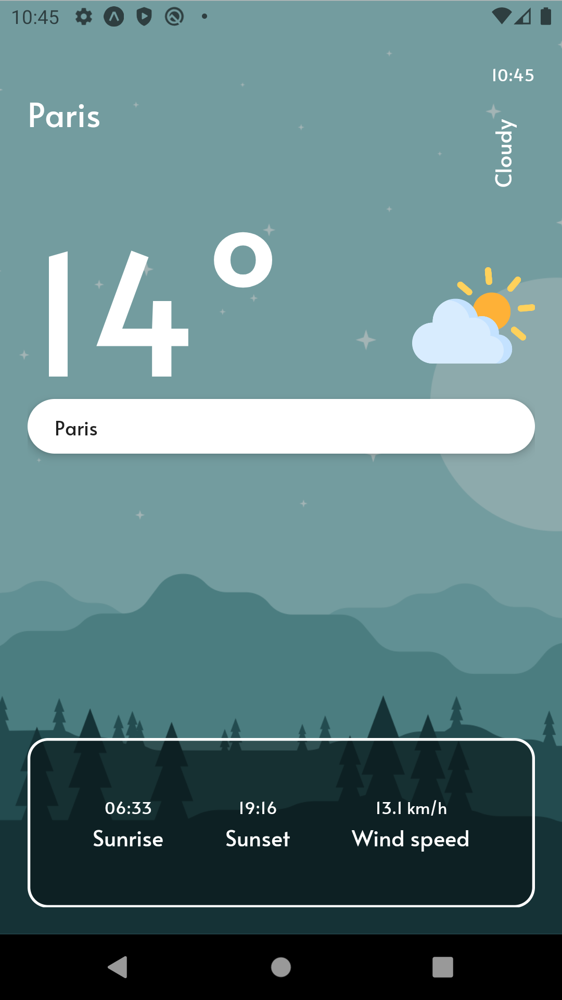
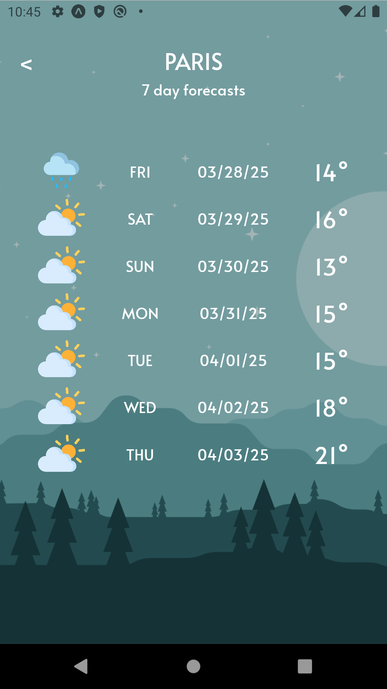

# React Native Meteorology

A beautiful weather application built with React Native and Expo that provides real-time weather information and forecasts.

## Features

- **Current Location Weather**: Automatically displays weather at your current location
- **Search by City**: Look up weather information for any city in the world
- **Detailed Weather Information**: View temperature, condition descriptions with matching imagery
- **Additional Weather Data**: Sunrise time, sunset time, wind speed, and more
- **7-Day Forecast**: See predicted weather conditions for the upcoming week
- **Modern UI/UX**: Beautiful user interface with custom fonts and intuitive navigation

## Screenshots

<div align="center">
  
  
</div>

## Technologies Used

- React Native (Expo)
- React Navigation for screen navigation
- Axios for API requests
- Expo Location for accessing device location
- Custom UI components with modern design principles

## APIs

This application utilizes free and open-source weather APIs to fetch:
- Current weather data
- Location-based weather information
- 7-day weather forecasts

## Getting Started

### Prerequisites

- Node.js
- npm
- Expo Go app (for mobile testing)

### Installation

1. Clone the repository
   ```
   git clone https://github.com/D1AS/Meteorology.git
   ```

2. Navigate to the project directory
   ```
   cd react-native-meteo
   ```

3. Install dependencies
   ```
   npm install
   ```

4. Start the application
   ```
   npx expo start
   ```

5. Scan the QR code with the Expo Go app on your mobile device or run in a simulator

## Usage

- The app will automatically show weather for your current location (requires location permissions)
- To search for a different city, use the search functionality
- Tap on the current temperature to view the 7-day forecast

## Project Structure

- `/api` - API integration and data fetching
- `/assets` - Images and font files
- `/components` - Reusable UI components
- `/pages` - Screen components
- `/utils` - Utility functions and helpers

## License

MIT

## Acknowledgments

- Weather data provided by https://open-meteo.com/
- Weather condition icons (sun, rain, snow, clouds, thunder) from the assets folder